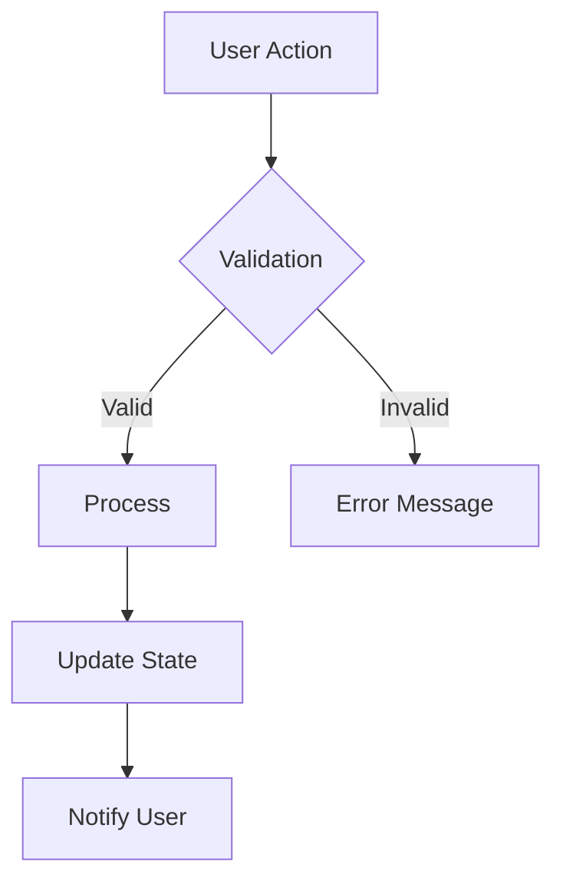
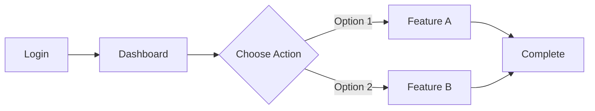
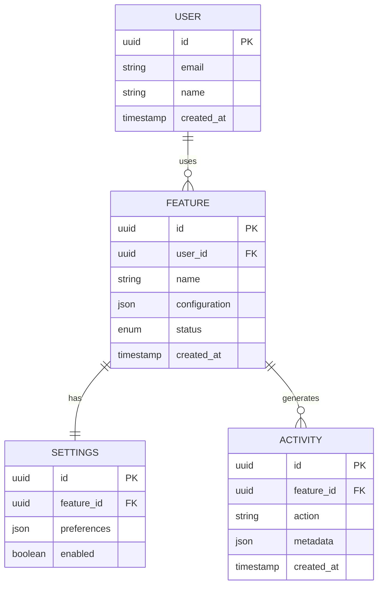
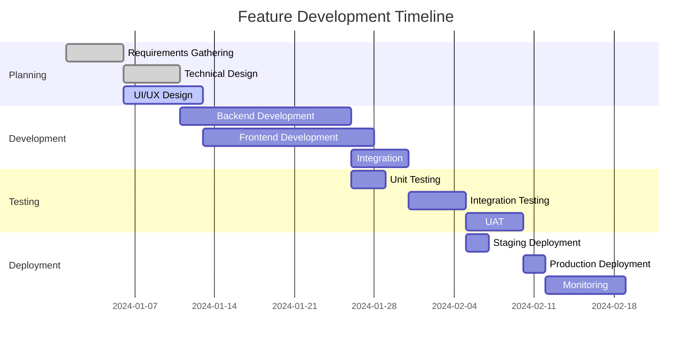

# Feature Specification: [Feature Name]

## Executive Summary

### Overview
**Feature Name**: [Descriptive name]
**Feature ID**: FEAT-[XXX]
**Version**: 1.0
**Status**: [Draft/In Review/Approved/In Development/Complete]
**Last Updated**: [Date]
**Author**: [Name]
**Reviewers**: [Names]

### Business Value
[2-3 sentences describing the business impact and value proposition]

### User Impact
[Brief description of how this affects end users]

---

## 📋 Table of Contents

1. [Background](#background)
2. [Objectives](#objectives)
3. [User Stories](#user-stories)
4. [Functional Requirements](#functional-requirements)
5. [Non-Functional Requirements](#non-functional-requirements)
6. [User Interface](#user-interface)
7. [Technical Design](#technical-design)
8. [Data Model](#data-model)
9. [API Specification](#api-specification)
10. [Security Considerations](#security-considerations)
11. [Performance Requirements](#performance-requirements)
12. [Testing Strategy](#testing-strategy)
13. [Rollout Plan](#rollout-plan)
14. [Success Metrics](#success-metrics)
15. [Risks & Mitigations](#risks--mitigations)
16. [Dependencies](#dependencies)
17. [Timeline](#timeline)
18. [Appendix](#appendix)

---

## 🎯 Background

### Problem Statement
[Detailed description of the problem this feature solves]

### Current State
[How things work today, including pain points]

### Market Research
[Competitive analysis, user research findings, market trends]

### Strategic Alignment
[How this aligns with company goals and product strategy]

---

## 🎯 Objectives

### Primary Goals
1. **Goal 1**: [Specific, measurable objective]
2. **Goal 2**: [Specific, measurable objective]
3. **Goal 3**: [Specific, measurable objective]

### Success Criteria
- [ ] Criterion 1: [Measurable success indicator]
- [ ] Criterion 2: [Measurable success indicator]
- [ ] Criterion 3: [Measurable success indicator]

### Out of Scope
- [Explicitly state what is NOT included]
- [Future considerations]
- [Intentional limitations]

---

## 👥 User Stories

### Primary User Stories

#### Story 1: [Core Functionality]
```
As a [type of user]
I want to [perform action]
So that I can [achieve goal]

Acceptance Criteria:
- Given [precondition]
  When [action]
  Then [expected result]
- Given [precondition]
  When [action]
  Then [expected result]

Priority: High
Points: 8
```

#### Story 2: [Secondary Feature]
```
As a [type of user]
I want to [perform action]
So that I can [achieve goal]

Acceptance Criteria:
- Given [precondition]
  When [action]
  Then [expected result]

Priority: Medium
Points: 5
```

### User Personas
| Persona | Description | Goals | Pain Points |
|---------|-------------|-------|-------------|
| Power User | [Description] | [What they want] | [Current frustrations] |
| Regular User | [Description] | [What they want] | [Current frustrations] |
| Admin | [Description] | [What they want] | [Current frustrations] |

### User Journey Map
```
1. Discovery → 2. Onboarding → 3. First Use → 4. Regular Use → 5. Advanced Use

[Detailed journey for each persona through the feature]
```

---

## ⚙️ Functional Requirements

### Core Functionality

#### FR-001: [Requirement Name]
**Description**: [Detailed description]
**Priority**: High/Medium/Low
**User Story**: STORY-001

**Behavior**:
- When [condition], the system shall [action]
- The system must [requirement]
- Users should be able to [capability]

**Validation Rules**:
- [Rule 1]
- [Rule 2]

**Error Handling**:
- If [error condition], then [system response]

#### FR-002: [Requirement Name]
[Similar structure]

### Feature Interactions


### Business Rules
| Rule ID | Description | Implementation |
|---------|-------------|----------------|
| BR-001 | [Business logic rule] | [How it's enforced] |
| BR-002 | [Business logic rule] | [How it's enforced] |

---

## 🔧 Non-Functional Requirements

### Performance Requirements
| Metric | Target | Measurement Method |
|--------|--------|-------------------|
| Response Time | < 200ms (p95) | APM monitoring |
| Throughput | 1000 req/sec | Load testing |
| Concurrent Users | 10,000 | Stress testing |
| Data Processing | 1M records/hour | Batch monitoring |

### Scalability Requirements
- **Horizontal Scaling**: Support auto-scaling from 2 to 20 instances
- **Data Volume**: Handle up to 100GB of data
- **Growth Rate**: Support 50% annual growth

### Reliability Requirements
- **Availability**: 99.9% uptime (43.2 minutes/month downtime)
- **Error Rate**: < 0.1% of requests
- **Recovery Time**: < 5 minutes (RTO)
- **Recovery Point**: < 1 hour data loss (RPO)

### Usability Requirements
- **Learning Curve**: New users productive within 15 minutes
- **Accessibility**: WCAG 2.1 AA compliance
- **Browser Support**: Chrome, Firefox, Safari, Edge (latest 2 versions)
- **Mobile Support**: Responsive design for tablets and phones

### Security Requirements
- **Authentication**: OAuth 2.0 / JWT tokens
- **Authorization**: Role-based access control (RBAC)
- **Data Encryption**: AES-256 at rest, TLS 1.3 in transit
- **Audit Logging**: All actions logged with user/timestamp
- **Compliance**: GDPR, SOC2, HIPAA (if applicable)

---

## 🎨 User Interface

### UI Components

#### Component 1: [Main Interface]
**Description**: [What it does]
**Location**: [Where it appears]

**Visual Design**:
```
┌─────────────────────────────────┐
│  Header                         │
├─────────┬───────────────────────┤
│ Sidebar │  Main Content Area    │
│         │                       │
│ Nav 1   │  [Component Details]  │
│ Nav 2   │                       │
│ Nav 3   │  [Actions]            │
│         │                       │
└─────────┴───────────────────────┘
```

**Interactions**:
- Click: [What happens]
- Hover: [Visual feedback]
- Drag: [If applicable]

#### Component 2: [Secondary Interface]
[Similar structure]

### User Flow Diagrams


### Responsive Design
| Breakpoint | Layout Changes |
|------------|----------------|
| Mobile (<768px) | Single column, collapsed menu |
| Tablet (768-1024px) | Two columns, condensed sidebar |
| Desktop (>1024px) | Full layout, expanded sidebar |

### Accessibility Features
- Keyboard navigation support
- Screen reader compatibility
- High contrast mode
- Focus indicators
- ARIA labels and roles

---

## 💻 Technical Design

### Architecture Overview
```
┌──────────────┐     ┌──────────────┐     ┌──────────────┐
│   Frontend   │────▶│   Backend    │────▶│   Database   │
│   (React)    │     │   (Node.js)  │     │ (PostgreSQL) │
└──────────────┘     └──────────────┘     └──────────────┘
        │                    │                     │
        ▼                    ▼                     ▼
┌──────────────┐     ┌──────────────┐     ┌──────────────┐
│     CDN      │     │  Message     │     │    Cache     │
│ (CloudFront) │     │   Queue      │     │   (Redis)    │
└──────────────┘     │  (RabbitMQ)  │     └──────────────┘
                     └──────────────┘
```

### Technology Stack
| Layer | Technology | Justification |
|-------|------------|---------------|
| Frontend | React 18 + TypeScript | Type safety, component reuse |
| Backend | Node.js + Express | JavaScript ecosystem |
| Database | PostgreSQL 14 | ACID compliance, JSON support |
| Cache | Redis 7 | Performance, pub/sub |
| Queue | RabbitMQ | Reliability, routing |

### Component Design
```
src/
├── components/
│   ├── FeatureName/
│   │   ├── FeatureName.tsx
│   │   ├── FeatureName.styles.ts
│   │   ├── FeatureName.test.tsx
│   │   ├── FeatureName.stories.tsx
│   │   └── index.ts
│   └── shared/
├── services/
│   ├── api/
│   └── feature/
├── hooks/
├── utils/
└── types/
```

### Design Patterns
- **Repository Pattern**: Data access abstraction
- **Service Layer**: Business logic encapsulation
- **Observer Pattern**: Event handling
- **Factory Pattern**: Object creation
- **Strategy Pattern**: Algorithm selection

### Code Examples
```typescript
// Example service implementation
export class FeatureService {
  constructor(
    private repository: FeatureRepository,
    private eventBus: EventBus
  ) {}

  async processFeature(data: FeatureData): Promise<FeatureResult> {
    // Validate input
    const validated = await this.validate(data);

    // Process business logic
    const result = await this.repository.save(validated);

    // Emit event
    await this.eventBus.emit('feature.processed', result);

    return result;
  }
}
```

---

## 📊 Data Model

### Entity Relationship Diagram


### Database Schema
```sql
-- Feature main table
CREATE TABLE features (
    id UUID PRIMARY KEY DEFAULT gen_random_uuid(),
    user_id UUID NOT NULL REFERENCES users(id),
    name VARCHAR(255) NOT NULL,
    description TEXT,
    configuration JSONB DEFAULT '{}',
    status VARCHAR(50) DEFAULT 'active',
    created_at TIMESTAMP DEFAULT NOW(),
    updated_at TIMESTAMP DEFAULT NOW(),
    deleted_at TIMESTAMP,

    INDEX idx_user_id (user_id),
    INDEX idx_status (status),
    INDEX idx_created_at (created_at)
);

-- Feature settings
CREATE TABLE feature_settings (
    id UUID PRIMARY KEY DEFAULT gen_random_uuid(),
    feature_id UUID NOT NULL REFERENCES features(id),
    key VARCHAR(100) NOT NULL,
    value JSONB,
    created_at TIMESTAMP DEFAULT NOW(),

    UNIQUE KEY unique_feature_key (feature_id, key)
);
```

### Data Migration Strategy
1. **Phase 1**: Schema creation
2. **Phase 2**: Data migration from legacy
3. **Phase 3**: Validation and reconciliation
4. **Phase 4**: Cutover and cleanup

---

## 🔌 API Specification

### REST Endpoints

#### Create Feature
```http
POST /api/v1/features
Content-Type: application/json
Authorization: Bearer {token}

{
  "name": "Feature Name",
  "description": "Feature description",
  "configuration": {
    "setting1": "value1",
    "setting2": "value2"
  }
}

Response: 201 Created
{
  "id": "uuid",
  "name": "Feature Name",
  "status": "active",
  "created_at": "2024-01-01T00:00:00Z"
}
```

#### Get Feature
```http
GET /api/v1/features/{id}
Authorization: Bearer {token}

Response: 200 OK
{
  "id": "uuid",
  "name": "Feature Name",
  "description": "Description",
  "configuration": {},
  "status": "active",
  "created_at": "2024-01-01T00:00:00Z",
  "updated_at": "2024-01-01T00:00:00Z"
}
```

#### Update Feature
```http
PUT /api/v1/features/{id}
Content-Type: application/json
Authorization: Bearer {token}

{
  "name": "Updated Name",
  "configuration": {
    "setting1": "new_value"
  }
}

Response: 200 OK
{
  "id": "uuid",
  "name": "Updated Name",
  "updated_at": "2024-01-02T00:00:00Z"
}
```

#### Delete Feature
```http
DELETE /api/v1/features/{id}
Authorization: Bearer {token}

Response: 204 No Content
```

### GraphQL Schema
```graphql
type Feature {
  id: ID!
  name: String!
  description: String
  configuration: JSON
  status: FeatureStatus!
  user: User!
  activities: [Activity!]!
  createdAt: DateTime!
  updatedAt: DateTime!
}

enum FeatureStatus {
  ACTIVE
  INACTIVE
  PENDING
  ARCHIVED
}

type Query {
  feature(id: ID!): Feature
  features(
    filter: FeatureFilter
    pagination: PaginationInput
  ): FeatureConnection!
}

type Mutation {
  createFeature(input: CreateFeatureInput!): Feature!
  updateFeature(id: ID!, input: UpdateFeatureInput!): Feature!
  deleteFeature(id: ID!): Boolean!
}
```

### WebSocket Events
```javascript
// Client subscription
socket.on('connect', () => {
  socket.emit('subscribe', { feature_id: 'uuid' });
});

// Server events
socket.emit('feature.updated', {
  id: 'uuid',
  changes: { /* ... */ },
  timestamp: '2024-01-01T00:00:00Z'
});

socket.emit('feature.deleted', {
  id: 'uuid',
  timestamp: '2024-01-01T00:00:00Z'
});
```

---

## 🔒 Security Considerations

### Threat Model
| Threat | Impact | Likelihood | Mitigation |
|--------|--------|------------|------------|
| SQL Injection | High | Low | Parameterized queries |
| XSS | Medium | Medium | Input sanitization, CSP |
| CSRF | Medium | Low | CSRF tokens |
| Data Breach | High | Low | Encryption, access control |
| DDoS | Medium | Medium | Rate limiting, CDN |

### Security Controls
1. **Authentication**
   - Multi-factor authentication (MFA)
   - Session management
   - Password policies

2. **Authorization**
   - Role-based access control (RBAC)
   - Attribute-based access control (ABAC)
   - API key management

3. **Data Protection**
   - Encryption at rest (AES-256)
   - Encryption in transit (TLS 1.3)
   - Data masking for PII

4. **Audit & Monitoring**
   - Comprehensive audit logging
   - Real-time threat detection
   - Security incident response plan

### Compliance Requirements
- [ ] GDPR: Data privacy and user rights
- [ ] SOC2: Security controls and processes
- [ ] HIPAA: Healthcare data protection (if applicable)
- [ ] PCI-DSS: Payment card data (if applicable)

---

## ⚡ Performance Requirements

### Performance Targets
| Metric | Target | Current | Gap |
|--------|--------|---------|-----|
| Page Load | < 2s | 3.5s | -1.5s |
| API Response | < 200ms | 150ms | ✓ |
| Database Query | < 50ms | 75ms | -25ms |
| Cache Hit Rate | > 90% | 85% | +5% |

### Optimization Strategies
1. **Frontend**
   - Code splitting and lazy loading
   - Image optimization (WebP, lazy load)
   - Bundle size optimization
   - Service worker caching

2. **Backend**
   - Query optimization
   - Connection pooling
   - Caching strategy (Redis)
   - Async processing

3. **Infrastructure**
   - CDN implementation
   - Auto-scaling configuration
   - Load balancing
   - Database replication

### Load Testing Plan
```yaml
scenarios:
  - name: Normal Load
    users: 100
    duration: 5m
    ramp_up: 30s

  - name: Peak Load
    users: 1000
    duration: 15m
    ramp_up: 2m

  - name: Stress Test
    users: 5000
    duration: 30m
    ramp_up: 5m
```

---

## 🧪 Testing Strategy

### Test Coverage Requirements
- Unit Tests: 80% code coverage
- Integration Tests: All API endpoints
- E2E Tests: Critical user journeys
- Performance Tests: Load and stress testing
- Security Tests: Penetration testing

### Test Plan

#### Unit Testing
```javascript
describe('FeatureService', () => {
  it('should create a new feature', async () => {
    // Arrange
    const input = { name: 'Test Feature' };

    // Act
    const result = await service.createFeature(input);

    // Assert
    expect(result).toHaveProperty('id');
    expect(result.name).toBe('Test Feature');
  });
});
```

#### Integration Testing
```javascript
describe('Feature API', () => {
  it('should handle the full feature lifecycle', async () => {
    // Create
    const created = await api.post('/features', data);
    expect(created.status).toBe(201);

    // Read
    const fetched = await api.get(`/features/${created.data.id}`);
    expect(fetched.status).toBe(200);

    // Update
    const updated = await api.put(`/features/${created.data.id}`, newData);
    expect(updated.status).toBe(200);

    // Delete
    const deleted = await api.delete(`/features/${created.data.id}`);
    expect(deleted.status).toBe(204);
  });
});
```

#### E2E Testing
```javascript
describe('Feature User Journey', () => {
  it('should complete the feature workflow', async () => {
    // Navigate to feature
    await page.goto('/features');

    // Create new feature
    await page.click('#create-feature');
    await page.fill('#feature-name', 'Test Feature');
    await page.click('#save');

    // Verify creation
    await expect(page).toHaveText('Feature created successfully');
  });
});
```

### Test Data Management
- Use factories for consistent test data
- Separate test database/environment
- Data cleanup after test runs
- Seed data for manual testing

---

## 🚀 Rollout Plan

### Deployment Strategy

#### Phase 1: Internal Testing (Week 1-2)
- Deploy to staging environment
- Internal team testing
- Bug fixes and adjustments
- Performance baseline

#### Phase 2: Beta Release (Week 3-4)
- 5% of users (feature flag)
- Monitor metrics closely
- Gather feedback
- Iterate based on feedback

#### Phase 3: Gradual Rollout (Week 5-6)
- 25% → 50% → 75% → 100%
- Monitor for issues at each stage
- Rollback plan ready
- Support team briefed

#### Phase 4: General Availability (Week 7)
- Full release to all users
- Marketing announcement
- Documentation published
- Training materials available

### Feature Flags
```javascript
// Feature flag configuration
{
  "feature_name_enabled": {
    "description": "Enable new feature",
    "default": false,
    "rules": [
      {
        "condition": "user.plan === 'premium'",
        "value": true
      },
      {
        "condition": "user.beta_tester === true",
        "value": true
      }
    ]
  }
}
```

### Rollback Plan
1. **Detection**: Monitor error rates and performance
2. **Decision**: If error rate > 1% or performance degrades > 20%
3. **Action**:
   - Disable feature flag immediately
   - Revert deployment if necessary
   - Communicate to stakeholders
4. **Post-mortem**: Analyze root cause and fix

### Communication Plan
| Audience | Method | Timing | Content |
|----------|--------|--------|---------|
| Internal Team | Slack | Week 1 | Testing instructions |
| Beta Users | Email | Week 3 | Beta invitation |
| All Users | In-app | Week 7 | Feature announcement |
| Support Team | Training | Week 6 | Support documentation |

---

## 📈 Success Metrics

### Key Performance Indicators (KPIs)
| Metric | Target | Measurement | Review Frequency |
|--------|--------|-------------|------------------|
| Adoption Rate | 60% in 30 days | Active users/Total users | Weekly |
| User Satisfaction | > 4.0/5.0 | In-app survey | Monthly |
| Performance | < 200ms p95 | APM monitoring | Daily |
| Error Rate | < 0.1% | Error tracking | Real-time |
| Conversion Rate | +15% | Analytics | Weekly |

### Success Criteria
- [ ] 60% user adoption within 30 days
- [ ] < 0.1% error rate in production
- [ ] 95% uptime in first month
- [ ] Positive user feedback (>4.0 rating)
- [ ] 20% reduction in support tickets

### Monitoring Dashboard
```
┌─────────────────────────────────────────┐
│           Feature Dashboard             │
├──────────────┬──────────────────────────┤
│ Adoption     │ Performance              │
│ ████████░ 80%│ Latency: 145ms          │
│              │ Errors: 0.05%           │
├──────────────┼──────────────────────────┤
│ User Feedback│ Usage Patterns          │
│ ⭐⭐⭐⭐☆ 4.2 │ Peak: 2-4 PM            │
│              │ Avg Session: 12 min     │
└──────────────┴──────────────────────────┘
```

### Analytics Events
```javascript
// Track feature usage
analytics.track('feature_used', {
  feature_id: 'uuid',
  action: 'create',
  metadata: {
    source: 'dashboard',
    time_to_complete: 45
  }
});

// Track performance
analytics.track('feature_performance', {
  feature_id: 'uuid',
  load_time: 150,
  api_calls: 3,
  cache_hits: 2
});
```

---

## ⚠️ Risks & Mitigations

### Technical Risks
| Risk | Probability | Impact | Mitigation Strategy |
|------|-------------|--------|-------------------|
| Database overload | Medium | High | Implement caching, optimize queries |
| API rate limiting | Low | Medium | Implement throttling, queue system |
| Browser compatibility | Low | Low | Progressive enhancement, polyfills |
| Data migration failure | Medium | High | Rollback plan, data validation |

### Business Risks
| Risk | Probability | Impact | Mitigation Strategy |
|------|-------------|--------|-------------------|
| Low user adoption | Medium | High | User training, gradual rollout |
| Feature complexity | Medium | Medium | Simplify UX, provide tutorials |
| Competitor releases similar | Low | Medium | Fast iteration, unique features |

### Operational Risks
| Risk | Probability | Impact | Mitigation Strategy |
|------|-------------|--------|-------------------|
| Support overwhelm | Medium | Medium | Documentation, training, FAQs |
| Performance degradation | Low | High | Monitoring, auto-scaling |
| Security vulnerability | Low | High | Security audit, penetration testing |

---

## 🔗 Dependencies

### Internal Dependencies
| Component | Team | Status | Notes |
|-----------|------|--------|-------|
| Authentication Service | Platform | Ready | v2.1 required |
| Payment Service | Billing | In Progress | ETA: Week 3 |
| Notification Service | Infrastructure | Ready | Using v1.5 |
| Analytics Pipeline | Data | Ready | New events needed |

### External Dependencies
| Service | Purpose | Status | Fallback |
|---------|---------|--------|----------|
| AWS S3 | File storage | Active | Local storage |
| SendGrid | Email delivery | Active | SES |
| Stripe | Payments | Active | Manual processing |
| Datadog | Monitoring | Active | CloudWatch |

### Third-party Libraries
```json
{
  "dependencies": {
    "react": "^18.2.0",
    "axios": "^1.4.0",
    "lodash": "^4.17.21",
    "date-fns": "^2.30.0"
  }
}
```

---

## 📅 Timeline

### Development Schedule


### Milestones
| Milestone | Date | Deliverable | Status |
|-----------|------|-------------|--------|
| M1: Design Complete | Week 2 | Mockups, Technical Design | ✅ |
| M2: Backend Complete | Week 5 | APIs, Database | 🔄 |
| M3: Frontend Complete | Week 6 | UI Components | ⏳ |
| M4: Testing Complete | Week 8 | All tests passing | ⏳ |
| M5: Production Ready | Week 9 | Deployed to production | ⏳ |

### Resource Allocation
| Role | Person | Allocation | Duration |
|------|--------|------------|----------|
| Product Manager | Alice | 50% | 9 weeks |
| Tech Lead | Bob | 75% | 9 weeks |
| Backend Dev | Charlie | 100% | 6 weeks |
| Frontend Dev | Diana | 100% | 6 weeks |
| QA Engineer | Eve | 100% | 3 weeks |
| DevOps | Frank | 25% | 2 weeks |

---

## 📎 Appendix

### A. Glossary
| Term | Definition |
|------|------------|
| API | Application Programming Interface |
| RBAC | Role-Based Access Control |
| SLA | Service Level Agreement |
| UUID | Universally Unique Identifier |
| JWT | JSON Web Token |

### B. References
1. [API Design Guidelines](link)
2. [Security Best Practices](link)
3. [UI/UX Standards](link)
4. [Testing Strategy](link)
5. [Deployment Process](link)

### C. Change Log
| Version | Date | Author | Changes |
|---------|------|--------|---------|
| 1.0 | 2024-01-01 | Alice | Initial draft |
| 1.1 | 2024-01-05 | Bob | Added technical design |
| 1.2 | 2024-01-10 | Charlie | Updated API specs |
| 1.3 | 2024-01-15 | Diana | Added UI mockups |

### D. Approval Sign-offs
| Role | Name | Date | Signature |
|------|------|------|-----------|
| Product Manager | Alice Smith | 2024-01-20 | ✓ |
| Engineering Manager | Bob Jones | 2024-01-20 | ✓ |
| QA Lead | Eve Wilson | 2024-01-20 | ✓ |
| Security Lead | Frank Brown | 2024-01-20 | Pending |

### E. Related Documents
- [Product Roadmap](link)
- [Architecture Documentation](link)
- [API Documentation](link)
- [User Research Findings](link)
- [Competitive Analysis](link)

### F. Contact Information
| Role | Name | Email | Slack |
|------|------|-------|-------|
| Product Owner | Alice Smith | alice@company.com | @alice |
| Tech Lead | Bob Jones | bob@company.com | @bob |
| Design Lead | Carol White | carol@company.com | @carol |
| QA Lead | Eve Wilson | eve@company.com | @eve |

---

## 📝 Notes

### Open Questions
1. [ ] How should we handle data migration for existing users?
2. [ ] What's the fallback if the third-party service is down?
3. [ ] Should we support bulk operations in v1?

### Decisions Made
1. ✅ Use PostgreSQL instead of MongoDB for ACID compliance
2. ✅ Implement feature flags for gradual rollout
3. ✅ Start with REST API, GraphQL in v2

### Action Items
- [ ] @Alice: Finalize UI mockups by Week 2
- [ ] @Bob: Complete API design review by Week 3
- [ ] @Charlie: Set up staging environment by Week 4
- [ ] @Diana: Create test data fixtures by Week 5

---

*Document Version: 1.0*
*Template Version: 1.0*
*Last Updated: [Date]*
*Next Review: [Date]*