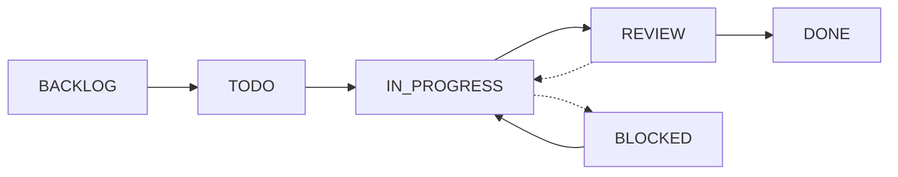

# Task Management System

## Overview
A structured approach to managing development tasks, tracking progress, and maintaining clarity throughout the project lifecycle.

---

## 📋 Task Types

### Epic
Large bodies of work that can be broken down into stories, typically spanning multiple sprints.

```markdown
# Epic: [Epic Name]

## Objective
[High-level business goal]

## Success Criteria
- [ ] Business outcome 1
- [ ] Business outcome 2
- [ ] Business outcome 3

## User Stories
- [ ] STORY-001: [Story title]
- [ ] STORY-002: [Story title]
- [ ] STORY-003: [Story title]

## Timeline
- Start: [Date]
- Target: [Date]
- Actual: [Date]

## Stakeholders
- Product Owner: [Name]
- Tech Lead: [Name]
- Design Lead: [Name]
```

### User Story
A feature described from the user's perspective.

```markdown
# STORY-[ID]: [Story Title]

## Story
**As a** [type of user]
**I want** [goal/desire]
**So that** [benefit/value]

## Acceptance Criteria
- [ ] Given [precondition], when [action], then [result]
- [ ] Given [precondition], when [action], then [result]
- [ ] Given [precondition], when [action], then [result]

## Technical Tasks
- [ ] TASK-001: [Backend] Implement API endpoint
- [ ] TASK-002: [Frontend] Create UI component
- [ ] TASK-003: [Database] Add migration
- [ ] TASK-004: [Testing] Write integration tests
- [ ] TASK-005: [Docs] Update API documentation

## Definition of Done
- [ ] Code complete and reviewed
- [ ] Tests written and passing
- [ ] Documentation updated
- [ ] Deployed to staging
- [ ] Product owner approval

## Story Points: [1-13]
## Priority: [High/Medium/Low]
## Sprint: [Sprint number]
```

### Technical Task
Specific implementation work.

```markdown
# TASK-[ID]: [Task Title]

## Description
[Detailed technical description]

## Parent Story
STORY-[ID]: [Story title]

## Implementation Details
```
[Code snippet or technical specification]
```

## Checklist
- [ ] Implementation complete
- [ ] Unit tests written
- [ ] Code reviewed
- [ ] Documentation updated
- [ ] No linting errors
- [ ] Performance validated

## Time Estimate
- Estimated: [X hours]
- Actual: [Y hours]

## Assignee: [Developer name]
## Status: [Todo/In Progress/Review/Done]
## Branch: `feature/TASK-[ID]-brief-description`
```

### Bug Report
Issue documentation and tracking.

```markdown
# BUG-[ID]: [Bug Title]

## Summary
[One-line bug description]

## Environment
- Environment: [Dev/Staging/Production]
- Browser/Client: [Details]
- Version: [App version]
- User: [Reporter]

## Steps to Reproduce
1. [Step 1]
2. [Step 2]
3. [Step 3]

## Expected Behavior
[What should happen]

## Actual Behavior
[What actually happens]

## Error Details
```
[Error message or stack trace]
```

## Screenshots/Videos
[Attach if applicable]

## Severity: [Critical/High/Medium/Low]
## Priority: [P1/P2/P3/P4]
## Status: [Open/In Progress/Resolved/Closed]

## Resolution
- Root Cause: [Description]
- Fix Applied: [Description]
- Verified By: [Name]
- Deployed: [Date/Version]
```

---

## 🎯 Sprint Management

### Sprint Planning Template
```markdown
# Sprint [Number]: [Sprint Name]

## Sprint Goal
[Clear, achievable objective for the sprint]

## Duration
- Start: [Date]
- End: [Date]
- Working Days: [Number]

## Team Capacity
| Team Member | Available Hours | Planned Hours | Buffer |
|-------------|----------------|---------------|---------|
| Dev 1       | 60             | 48            | 20%     |
| Dev 2       | 60             | 48            | 20%     |
| Dev 3       | 40             | 32            | 20%     |
| **Total**   | **160**        | **128**       | **20%** |

## Committed Stories
| Story ID | Title | Points | Assignee | Priority |
|----------|-------|--------|----------|----------|
| STORY-001| [...] | 5      | Dev 1    | High     |
| STORY-002| [...] | 3      | Dev 2    | High     |
| STORY-003| [...] | 8      | Dev 3    | Medium   |
| **Total**| -     | **16** | -        | -        |

## Sprint Backlog
- [ ] STORY-001: [Title]
  - [ ] TASK-001: [Backend task]
  - [ ] TASK-002: [Frontend task]
  - [ ] TASK-003: [Testing task]
- [ ] STORY-002: [Title]
  - [ ] TASK-004: [Task]
  - [ ] TASK-005: [Task]

## Risks & Dependencies
- Risk 1: [Description] → Mitigation: [Action]
- Dependency 1: [Description] → Owner: [Name]

## Success Metrics
- [ ] All high priority stories completed
- [ ] Test coverage > 80%
- [ ] No critical bugs in production
- [ ] Sprint goal achieved
```

### Daily Standup Template
```markdown
# Daily Standup - [Date]

## Team Member: [Name]

### Yesterday
- ✅ Completed TASK-001: [Description]
- 🔄 Progress on TASK-002: [Status]

### Today
- [ ] Complete TASK-002: [Description]
- [ ] Start TASK-003: [Description]
- [ ] Code review for PR #123

### Blockers
- 🚫 [Blocker description] - Need help from [Name]

## Team Status
| Member | Yesterday | Today | Blockers |
|--------|-----------|-------|----------|
| Dev 1  | ✅ TASK-001 | TASK-002 | None |
| Dev 2  | 🔄 TASK-004 | TASK-004 | Waiting for API |
| Dev 3  | ✅ TASK-007 | TASK-008 | None |

## Action Items
- [ ] [Dev 1] to help [Dev 2] with API issue
- [ ] Team to review PR #123 by EOD
```

### Sprint Retrospective Template
```markdown
# Sprint [Number] Retrospective

## Sprint Summary
- Sprint Goal: [Was it achieved? Yes/No/Partial]
- Velocity: Planned [X] vs Actual [Y] points
- Stories Completed: [X of Y]

## Metrics
- Velocity: [Points]
- Bugs Found: [Number]
- Bugs Fixed: [Number]
- Test Coverage: [Percentage]
- Code Review Time: [Average hours]

## What Went Well 😊
- [Positive point 1]
- [Positive point 2]
- [Positive point 3]

## What Could Be Improved 😕
- [Improvement area 1]
- [Improvement area 2]
- [Improvement area 3]

## Action Items 🎯
| Action | Owner | Due Date | Status |
|--------|-------|----------|---------|
| [Action 1] | [Name] | [Date] | [ ] |
| [Action 2] | [Name] | [Date] | [ ] |
| [Action 3] | [Name] | [Date] | [ ] |

## Team Health Check
- Morale: ⭐⭐⭐⭐☆
- Collaboration: ⭐⭐⭐⭐⭐
- Productivity: ⭐⭐⭐☆☆
- Quality: ⭐⭐⭐⭐☆
```

---

## 🔄 Task Workflow States

### Kanban Board Structure
```
┌─────────────┬──────────────┬─────────────┬──────────────┬────────────┐
│   BACKLOG   │     TODO     │ IN PROGRESS │    REVIEW    │    DONE    │
├─────────────┼──────────────┼─────────────┼──────────────┼────────────┤
│ • TASK-010  │ • TASK-007   │ • TASK-004  │ • TASK-002   │ • TASK-001 │
│ • TASK-011  │ • TASK-008   │   (Dev 1)   │   (PR #45)   │   ✅       │
│ • TASK-012  │ • TASK-009   │ • TASK-005  │ • TASK-003   │ • TASK-006 │
│             │              │   (Dev 2)   │   (PR #46)   │   ✅       │
└─────────────┴──────────────┴─────────────┴──────────────┴────────────┘
```

### State Transitions


### Task States
- **Backlog**: Not yet prioritized for work
- **Todo**: Ready to be worked on
- **In Progress**: Actively being worked on
- **Blocked**: Cannot proceed due to dependency
- **Review**: Code review or QA testing
- **Done**: Completed and verified

---

## 📊 Progress Tracking

### Burndown Chart Data
```markdown
# Sprint [X] Burndown

## Daily Progress
| Day | Date | Remaining Points | Ideal Points | Status |
|-----|------|-----------------|--------------|---------|
| 1   | Mon  | 40              | 40           | On Track |
| 2   | Tue  | 35              | 36           | Ahead    |
| 3   | Wed  | 32              | 32           | On Track |
| 4   | Thu  | 30              | 28           | Behind   |
| 5   | Fri  | 25              | 24           | Behind   |

## Burndown Analysis
- Current Velocity: [X points/day]
- Required Velocity: [Y points/day]
- Projected Completion: [Date]
- Risk Level: [Low/Medium/High]
```

### Velocity Tracking
```markdown
# Team Velocity

## Historical Velocity
| Sprint | Planned | Completed | Velocity | Notes |
|--------|---------|-----------|----------|-------|
| 1      | 32      | 28        | 28       | Team learning |
| 2      | 30      | 30        | 30       | Good sprint |
| 3      | 35      | 33        | 33       | Minor blockers |
| 4      | 35      | 35        | 35       | Excellent |
| 5      | 40      | 32        | 32       | Unplanned work |

## Average Velocity: 31.6 points/sprint
## Velocity Trend: Stabilizing
```

---

## 🚀 Release Management

### Release Planning Template
```markdown
# Release [Version]: [Codename]

## Release Information
- Version: [X.Y.Z]
- Type: [Major/Minor/Patch]
- Date: [Target date]
- Environment: [Production/Staging]

## Features Included
- [ ] EPIC-001: [Epic name]
  - STORY-001: [Story name]
  - STORY-002: [Story name]
- [ ] EPIC-002: [Epic name]
  - STORY-003: [Story name]

## Pre-Release Checklist
- [ ] All features complete
- [ ] All tests passing
- [ ] Performance benchmarks met
- [ ] Security audit complete
- [ ] Documentation updated
- [ ] Release notes prepared
- [ ] Rollback plan ready
- [ ] Stakeholders notified

## Release Steps
1. [ ] Create release branch
2. [ ] Run integration tests
3. [ ] Deploy to staging
4. [ ] UAT sign-off
5. [ ] Deploy to production
6. [ ] Smoke tests
7. [ ] Monitor metrics
8. [ ] Announce release

## Rollback Plan
```bash
# If issues detected:
1. git checkout [previous-version]
2. ./deploy.sh rollback
3. Notify stakeholders
4. Investigate issues
```

## Post-Release
- [ ] Monitor error rates
- [ ] Check performance metrics
- [ ] Gather user feedback
- [ ] Document lessons learned
- [ ] Archive release artifacts
```

### Release Notes Template
```markdown
# Release Notes - v[X.Y.Z]

## 🎉 What's New
- **[Feature Name]**: [Brief description of the feature]
- **[Feature Name]**: [Brief description of the feature]

## 🔧 Improvements
- Enhanced [component] performance by X%
- Improved [feature] user experience
- Optimized [process] for better efficiency

## 🐛 Bug Fixes
- Fixed issue where [description] ([#issue])
- Resolved [problem] in [component] ([#issue])
- Corrected [behavior] when [condition] ([#issue])

## 💔 Breaking Changes
- [API/Component]: [Description of change and migration path]

## 📦 Dependencies
- Updated [package] from vX.Y to vA.B
- Added [new package] for [purpose]
- Removed deprecated [package]

## 📋 Known Issues
- [Issue description] - Workaround: [steps]
- [Issue description] - Fix planned for vX.Y.Z

## 🔄 Migration Guide
```bash
# Steps to migrate from previous version
1. Backup database
2. Run migration script: ./migrate.sh
3. Update configuration files
4. Restart services
```

## 📊 Metrics
- Load time improved by 25%
- API response time reduced by 40ms
- Bundle size decreased by 15KB

## 👥 Contributors
Thanks to everyone who contributed to this release!
- @developer1 - [Feature/Fix]
- @developer2 - [Feature/Fix]

---
**Full Changelog**: [vX.Y.Z...vA.B.C]
```

---

## 📈 Reporting Templates

### Weekly Status Report
```markdown
# Weekly Status Report - Week [X]

## Executive Summary
[2-3 sentences on overall progress and key achievements]

## Progress Overview
- Sprint Progress: [X]% complete
- Stories Completed: [X of Y]
- Bugs Fixed: [Number]
- Blockers Resolved: [Number]

## Completed This Week
- ✅ STORY-001: [Title] - [Impact]
- ✅ STORY-002: [Title] - [Impact]
- ✅ BUG-010: [Critical fix] - [Impact]

## In Progress
- 🔄 STORY-003: [Title] - 75% complete
- 🔄 STORY-004: [Title] - 40% complete

## Upcoming Next Week
- [ ] Complete STORY-003
- [ ] Start STORY-005
- [ ] Deploy Release v1.2.0

## Risks & Issues
| Risk/Issue | Impact | Mitigation | Owner |
|------------|--------|------------|-------|
| [Description] | High | [Action] | [Name] |

## Metrics Dashboard
- Velocity: [Current vs Target]
- Quality: [Bug rate]
- Productivity: [Stories/week]
- Team Health: [Morale score]

## Action Items
- [ ] [Action] - Owner: [Name] - Due: [Date]
- [ ] [Action] - Owner: [Name] - Due: [Date]
```

### Monthly Progress Report
```markdown
# Monthly Progress Report - [Month Year]

## Executive Summary
[Brief overview of the month's accomplishments and challenges]

## Goals vs Achievements
| Goal | Target | Actual | Status |
|------|--------|--------|---------|
| Features Released | 10 | 12 | ✅ Exceeded |
| Bug Resolution | 95% | 92% | ⚠️ Close |
| Test Coverage | 80% | 85% | ✅ Exceeded |
| Performance | <200ms | 180ms | ✅ Met |

## Completed Epics
1. **EPIC-001**: [Name] - [Business Impact]
2. **EPIC-002**: [Name] - [Business Impact]

## Team Performance
- Sprints Completed: [X]
- Average Velocity: [Y points]
- Estimation Accuracy: [Z%]
- On-time Delivery: [%]

## Quality Metrics
- Production Incidents: [Number]
- Mean Time to Resolution: [Hours]
- Code Review Turnaround: [Hours]
- Test Pass Rate: [%]

## Upcoming Priorities
1. [Priority 1] - [Timeline]
2. [Priority 2] - [Timeline]
3. [Priority 3] - [Timeline]

## Lessons Learned
- **What Worked**: [Description]
- **What Didn't**: [Description]
- **Improvements Made**: [Description]

## Resource Needs
- [Need 1]: [Justification]
- [Need 2]: [Justification]
```

---

## 🔧 Task Management Best Practices

### Effective Task Creation
1. **Clear Title**: Descriptive and actionable
2. **Detailed Description**: Context and requirements
3. **Acceptance Criteria**: Measurable success conditions
4. **Proper Sizing**: Tasks should be 1-2 days max
5. **Dependencies**: Clearly identified and tracked
6. **Priority**: Based on business value and urgency

### Task Estimation Guidelines
```
Story Points Scale (Fibonacci):
1  - Trivial change (< 2 hours)
2  - Simple task (2-4 hours)
3  - Standard task (4-8 hours)
5  - Complex task (1-2 days)
8  - Very complex (2-3 days)
13 - Needs breakdown (> 3 days)
```

### Priority Matrix
```
         URGENT          NOT URGENT
    ┌──────────────┬──────────────┐
  I │ P1: Critical │ P2: High     │
  M │ Do Now       │ Schedule     │
  P ├──────────────┼──────────────┤
  O │ P3: Medium   │ P4: Low      │
  R │ Delegate     │ Backlog      │
  T └──────────────┴──────────────┘
    A
    N
    T
```

### Definition of Ready
- [ ] User story is clear and complete
- [ ] Acceptance criteria defined
- [ ] Dependencies identified
- [ ] Estimated by team
- [ ] Design/mockups available (if needed)
- [ ] Technical approach agreed upon

### Definition of Done
- [ ] Code complete and pushed
- [ ] Tests written and passing
- [ ] Code reviewed and approved
- [ ] Documentation updated
- [ ] No critical issues
- [ ] Deployed to staging
- [ ] Product owner accepted

---

## 📱 Task Communication

### Task Comments Template
```markdown
## Status Update - [Date Time]
Current Status: [In Progress/Blocked/Review]
Progress: [X]% complete

### Completed
- [What was done]

### Next Steps
- [What's next]

### Questions/Blockers
- [Any issues or questions]

@mention [team member] for visibility
```

### Handoff Template
```markdown
## Task Handoff - TASK-[ID]

### Current State
- Progress: [X]% complete
- Branch: `feature/task-id`
- Last commit: [hash]

### Work Completed
- [List of completed items]

### Remaining Work
- [ ] [Task 1]
- [ ] [Task 2]

### Important Context
- [Key decision made]
- [Technical consideration]
- [Known issue]

### Files Modified
- `src/file1.js` - [What changed]
- `src/file2.js` - [What changed]

### How to Continue
1. Pull latest from branch
2. [Specific setup steps]
3. [Where to start]

### Questions?
Contact @[your-name] on Slack
```

---

## 🎮 Task Automation

### Git Branch Naming
```bash
# Feature branch
feature/TASK-123-short-description

# Bug fix branch
bugfix/BUG-456-brief-description

# Hotfix branch
hotfix/CRITICAL-789-urgent-fix

# Release branch
release/v1.2.0
```

### Commit Message Format
```bash
# Format: <type>(<scope>): <subject>

feat(api): add user authentication endpoint
fix(ui): resolve button alignment issue
docs(readme): update installation instructions
test(auth): add integration tests
refactor(db): optimize query performance
chore(deps): update dependencies
```

### Task Automation Scripts
```bash
#!/bin/bash
# create-task.sh - Create new task with boilerplate

TASK_ID=$1
TASK_TITLE=$2
TASK_TYPE=${3:-feature}

# Create branch
git checkout -b ${TASK_TYPE}/TASK-${TASK_ID}-$(echo ${TASK_TITLE} | tr ' ' '-' | tr '[:upper:]' '[:lower:]')

# Create task file
cat > tasks/TASK-${TASK_ID}.md << EOF
# TASK-${TASK_ID}: ${TASK_TITLE}

## Description
[Add description]

## Checklist
- [ ] Implementation
- [ ] Tests
- [ ] Documentation
- [ ] Review

## Status: TODO
## Assignee: $(git config user.name)
## Created: $(date +%Y-%m-%d)
EOF

echo "Task TASK-${TASK_ID} created!"
```

---

## 📚 Task Management Tools Integration

### GitHub Issues Template
```yaml
name: Task Template
about: Create a new development task
title: '[TASK] '
labels: 'task'
assignees: ''

---

**Task Description**
A clear and concise description of the task.

**Acceptance Criteria**
- [ ] Criterion 1
- [ ] Criterion 2

**Technical Details**
Any technical specifications or considerations.

**Dependencies**
List any dependencies or blockers.

**Time Estimate**
Estimated time to complete: X hours
```

### Jira Integration
```markdown
# Jira Task Template

## Issue Type: Task/Story/Bug
## Project: [PROJECT_KEY]
## Components: [Frontend/Backend/Database]
## Labels: [sprint-X, priority-high]
## Story Points: [1-13]

## Description
As a [user type]
I want [functionality]
So that [business value]

## Acceptance Criteria
{panel:title=Acceptance Criteria}
- Given [context], when [action], then [outcome]
{panel}

## Technical Notes
{code:java}
// Implementation notes
{code}
```

---

## 🔍 Task Search & Filter

### Quick Filters
```markdown
# My Tasks
- Assigned to me: [filter: assignee = "me"]
- Created by me: [filter: creator = "me"]
- Watching: [filter: watcher = "me"]

# By Status
- Open tasks: [filter: status = "TODO" OR status = "IN_PROGRESS"]
- Blocked: [filter: status = "BLOCKED"]
- In Review: [filter: status = "REVIEW"]

# By Priority
- Critical: [filter: priority = "P1"]
- High Priority: [filter: priority = "P1" OR priority = "P2"]
- Overdue: [filter: dueDate < now()]

# By Type
- Bugs: [filter: type = "BUG"]
- Features: [filter: type = "STORY"]
- Technical Debt: [filter: label = "tech-debt"]
```

---

## 📖 Task Management Glossary

- **Epic**: Large feature spanning multiple sprints
- **Story**: User-facing functionality
- **Task**: Technical implementation work
- **Sub-task**: Smaller unit of work within a task
- **Bug**: Defect in existing functionality
- **Spike**: Research/investigation task
- **Tech Debt**: Code requiring refactoring
- **Blocker**: Issue preventing progress
- **Sprint**: Fixed time period for work
- **Backlog**: Prioritized list of work
- **Velocity**: Team's completion rate
- **Burndown**: Progress visualization
- **Stand-up**: Daily progress meeting
- **Retrospective**: Sprint review meeting
- **Grooming**: Backlog refinement session

---

*Template Version: 1.0*
*Last Updated: [Date]*