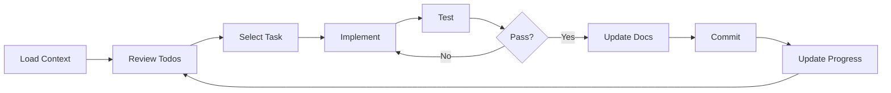
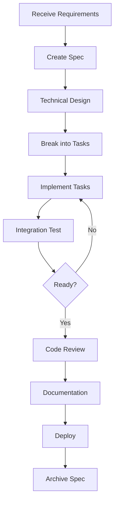
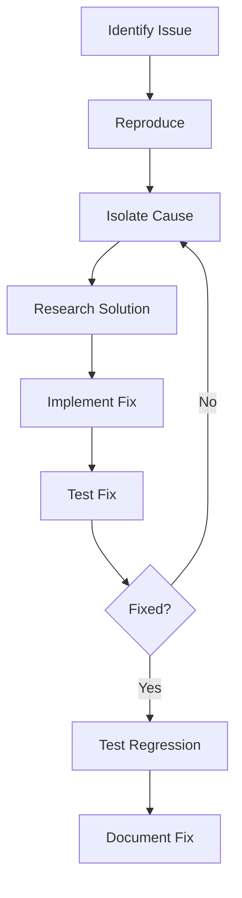

# Claude Workflow Optimization Guide

## Executive Summary
This guide provides comprehensive strategies for optimizing your workflow when working with Claude on software development projects. It covers setup, best practices, common patterns, and troubleshooting approaches to maximize productivity and code quality.

---

## 🚀 Quick Start Checklist

### Initial Setup (One-time)
- [ ] Create project structure following the Claude workspace pattern
- [ ] Initialize `CLAUDE.md` in project root
- [ ] Set up `.claude/` directory structure
- [ ] Create initial context documents
- [ ] Configure conventions and standards
- [ ] Set up prompt templates
- [ ] Define agent configurations

### Per Session
- [ ] Load `CLAUDE.md` at conversation start
- [ ] Load relevant context files
- [ ] State clear objectives
- [ ] Use appropriate agents
- [ ] Track progress with todos
- [ ] Update documentation as you go

---

## 📁 Optimal Project Structure

### Essential Files
```
project-root/
├── CLAUDE.md                      # ← Always read first
├── .claude/                       # ← Claude workspace
│   ├── README.md                  # Workspace guide
│   ├── context/                   # Project context
│   │   ├── project-overview.md   # ← Load second
│   │   ├── conventions.md        # ← Reference frequently
│   │   ├── tech-stack.md
│   │   ├── decisions.md
│   │   └── glossary.md
│   ├── features/                  # Active features
│   │   └── [feature-name]/
│   │       ├── spec.md
│   │       ├── progress.md
│   │       └── notes.md
│   ├── prompts/                   # Reusable prompts
│   ├── agents/                    # Agent configs
│   └── archive/                   # ⚠️ Never read
```

### File Purposes
| File | Purpose | When to Update |
|------|---------|----------------|
| `CLAUDE.md` | Master instructions | When workflow changes |
| `project-overview.md` | Full context | Major architecture changes |
| `conventions.md` | Coding standards | New patterns adopted |
| `tech-stack.md` | Technology details | Stack changes |
| `decisions.md` | ADRs | Important decisions made |
| Feature specs | Current work | Before starting feature |
| Progress files | Task tracking | During development |

---

## 🎯 Workflow Patterns

### 1. Starting a New Feature
```markdown
## Optimal Prompt Structure
"Load CLAUDE.md and docs/.claude/context/project-overview.md
Starting feature: [name]
Spec at: docs/.claude/features/[name]/spec.md

Objectives:
1. [Specific goal 1]
2. [Specific goal 2]

Constraints:
- [Any limitations]
- [Performance requirements]

Please create implementation plan using todos."
```

### 2. Resuming Work
```markdown
## Continuation Prompt
"Load CLAUDE.md
Continuing: [feature-name]
Last completed: [what was done]
Current task: [what's in progress]
Today's goal: [specific objective]

Check docs/.claude/features/[name]/progress.md for status."
```

### 3. Debugging Session
```markdown
## Debug Prompt
"Load conventions.md
Issue: [description]
Error: [error message]
Context: [when it occurs]
Tried: [what you've attempted]

Please diagnose and fix."
```

### 4. Code Review
```markdown
## Review Prompt
"Activate Code Reviewer agent
Review scope: [files/PR]
Focus: [security/performance/standards]
Standards: docs/.claude/context/conventions.md

Please provide actionable feedback."
```

### 5. Refactoring
```markdown
## Refactor Prompt
"Current code: [file references]
Issues: [what needs improvement]
Goals: [desired outcome]
Constraints: [backwards compatibility, etc.]

Please refactor following our conventions."
```

---

## 💡 Best Practices

### 1. Context Management

#### DO:
- Load only relevant context files
- Update context as you learn
- Archive obsolete information immediately
- Keep specs concise and current
- Reference file paths explicitly

#### DON'T:
- Load entire codebase at once
- Keep outdated information
- Use vague references
- Forget to update progress

### 2. Clear Communication

#### Effective Prompts:
```markdown
GOOD: "Implement user authentication using JWT, following our Django conventions at docs/.claude/context/conventions-django.md"

BAD: "Add auth"
```

#### Structured Requests:
```markdown
## Request Template
Context: [Current situation]
Problem: [What needs solving]
Requirements: [Specific needs]
Constraints: [Limitations]
Success Criteria: [How to measure]
```

### 3. Progressive Development

#### Incremental Approach:
1. Start with minimal implementation
2. Test and validate
3. Add features incrementally
4. Refactor as needed
5. Document changes

#### Task Breakdown:
```markdown
Epic → Stories → Tasks → Subtasks
(Week) → (Days) → (Hours) → (Minutes)
```

### 4. Documentation Discipline

#### Update Immediately:
- Decision made → Update decisions.md
- Pattern discovered → Update conventions.md
- Feature complete → Archive spec
- Lesson learned → Update guide

#### Documentation Hierarchy:
```
Official Docs (docs/)
    ↑
Working Docs (.claude/features/)
    ↑
Session Notes (progress.md)
    ↑
Claude Conversation
```

---

## 🤖 Agent Utilization Strategy

### Agent Selection Matrix
| Task Type | Primary Agent | Secondary Agent | When to Use |
|-----------|--------------|-----------------|-------------|
| New Feature | Product Manager | System Architect | Requirements → Design |
| Implementation | Backend/Frontend Dev | Test Engineer | Build → Test |
| Bug Fix | Debugging Agent | Code Reviewer | Fix → Validate |
| Optimization | Performance Optimizer | System Architect | Profile → Improve |
| Documentation | Documentation Specialist | - | Any major change |
| Security | Security Auditor | Code Reviewer | Regular audits |
| Deployment | DevOps Engineer | Test Engineer | Release preparation |

### Agent Chaining Patterns

#### Feature Development Chain:
```
Product Manager (requirements)
    → System Architect (design)
        → Backend Developer (API)
        → Frontend Developer (UI)
            → Test Engineer (testing)
                → Documentation Specialist (docs)
                    → DevOps Engineer (deploy)
```

#### Bug Resolution Chain:
```
Debugger (identify)
    → Developer (fix)
        → Test Engineer (verify)
            → Code Reviewer (validate)
```

---

## 🔄 Common Workflows

### Daily Development Cycle


### Feature Workflow


### Debug Workflow


---

## 🛠️ Optimization Techniques

### 1. Context Optimization

#### Minimal Context Loading:
```python
# Priority Order
1. CLAUDE.md (always)
2. project-overview.md (if needed)
3. Feature spec (current work)
4. Conventions (when coding)
5. Other files (as required)
```

#### Context Caching Strategy:
- Keep frequently used patterns in conventions.md
- Store reusable prompts in prompts/
- Archive completed features immediately
- Use references instead of repetition

### 2. Prompt Engineering

#### Structured Prompts:
```markdown
## Task: [Clear title]
Input: [Specific data/files]
Process: [Steps to follow]
Output: [Expected result]
Format: [How to present]
```

#### Batch Operations:
```markdown
"Please perform these tasks:
1. Fix bug in auth.py:45
2. Add test for login function
3. Update API documentation
4. Create migration for new field

Use our conventions and track with todos."
```

### 3. Performance Optimization

#### Fast Iterations:
- Use hot reload in development
- Run tests in watch mode
- Keep feedback loops short
- Parallelize independent tasks

#### Efficient Reviews:
```markdown
"Review only changed lines in:
- src/auth.py (lines 45-67)
- tests/test_auth.py (lines 23-45)
Focus on security and performance."
```

### 4. Error Prevention

#### Validation Checklist:
- [ ] Requirements clear?
- [ ] Conventions loaded?
- [ ] Tests defined?
- [ ] Edge cases considered?
- [ ] Error handling planned?

#### Pre-implementation Review:
```markdown
"Before implementing, validate:
1. Approach aligns with architecture
2. No existing solution available
3. Performance implications acceptable
4. Security considerations addressed"
```

---

## 📊 Metrics & Monitoring

### Productivity Metrics
| Metric | Target | Measurement |
|--------|--------|-------------|
| Context Load Time | < 30 seconds | Time to ready |
| Task Completion | > 80% daily | Todos completed |
| Code Quality | < 5 issues/PR | Review feedback |
| Documentation Lag | < 1 day | Update frequency |
| Rework Rate | < 20% | Changes after review |

### Quality Indicators
- Clean first implementation
- Minimal review feedback
- Tests pass first time
- Documentation accurate
- No regression bugs

### Progress Tracking
```markdown
## Daily Progress Template
Date: [YYYY-MM-DD]
Session: [AM/PM]

Planned:
- [ ] Task 1
- [ ] Task 2

Completed:
- [x] Task 1
- [ ] Task 2 (80%)

Blockers:
- [Issue and resolution]

Tomorrow:
- Continue Task 2
- Start Task 3

Notes:
- [Learnings/Decisions]
```

---

## 🚨 Troubleshooting Guide

### Common Issues & Solutions

#### Issue: Claude loses context
**Solution:**
```markdown
"Let's recalibrate. Current status:
- Working on: [feature]
- Last action: [what was done]
- Current file: [path]
- Next step: [what's needed]"
```

#### Issue: Inconsistent code style
**Solution:**
```markdown
"Load docs/.claude/context/conventions.md
Please refactor this code to match our standards:
[paste code]"
```

#### Issue: Complex debugging
**Solution:**
```markdown
"Activate Debugging Agent
Symptoms: [what's wrong]
Expected: [correct behavior]
Reproduce: [steps]
Please diagnose systematically."
```

#### Issue: Unclear requirements
**Solution:**
```markdown
"Activate Product Manager agent
Vague requirement: [original text]
Please create clear user stories with acceptance criteria."
```

#### Issue: Performance problems
**Solution:**
```markdown
"Activate Performance Optimizer agent
Metric: [what's slow]
Current: [measurement]
Target: [goal]
Please profile and optimize."
```

---

## 🎓 Learning & Improvement

### Continuous Improvement Cycle
1. **Document patterns** → conventions.md
2. **Create templates** → prompts/
3. **Refine agents** → agents/
4. **Update guides** → optimization guide
5. **Share learnings** → team knowledge base

### Weekly Retrospective
```markdown
## Week [X] Retrospective

### What Worked Well
- [Success 1]
- [Success 2]

### What Could Improve
- [Issue 1] → [Solution]
- [Issue 2] → [Solution]

### Workflow Updates
- [ ] Update CLAUDE.md
- [ ] Refine conventions
- [ ] Add new prompts
- [ ] Adjust agents

### Metrics
- Velocity: [points]
- Quality: [defect rate]
- Satisfaction: [1-10]
```

### Knowledge Capture
```markdown
## Lesson Learned Template

Date: [YYYY-MM-DD]
Context: [Situation]
Problem: [What went wrong]
Solution: [What fixed it]
Prevention: [How to avoid]

Update Required:
- [ ] Conventions
- [ ] Documentation
- [ ] Process
- [ ] Training
```

---

## 🔗 Quick Reference

### Essential Commands
```bash
# Start new feature
git checkout -b feature/[name]

# Update progress
echo "## $(date +%Y-%m-%d)" >> progress.md

# Archive completed
mv features/[name] archive/

# Quick context
cat CLAUDE.md | head -20
```

### Key File Paths
```
CLAUDE.md                               # Start here
.claude/context/project-overview.md    # Full context
.claude/context/conventions.md         # Standards
.claude/features/*/spec.md            # Current work
.claude/prompts/                      # Reusables
```

### Agent Triggers
```
"Activate [Agent] agent"
"Use [Agent] to [task]"
"Please engage [Agent] for [purpose]"
```

### Progress Commands
```
"Create todo list"
"Update task status"
"Show current progress"
"Mark [task] complete"
```

---

## 📚 Advanced Techniques

### 1. Context Switching
```markdown
## Switching Between Features
"Saving context for Feature A.
Switching to Feature B.
Load: docs/.claude/features/feature-b/spec.md
Previous work: [summary]
Resume from: [task]"
```

### 2. Parallel Development
```markdown
## Parallel Tasks
"Execute in parallel:
1. Backend: Implement API endpoints
2. Frontend: Create UI components
3. Tests: Write test cases
4. Docs: Update API documentation

Sync point: Integration testing"
```

### 3. Complex Refactoring
```markdown
## Large Refactor Strategy
"Phase 1: Analysis
- Map dependencies
- Identify impacts
- Plan migration path

Phase 2: Preparation
- Create compatibility layer
- Write migration tests
- Document changes

Phase 3: Execution
- Refactor incrementally
- Test each step
- Maintain backwards compatibility

Phase 4: Cleanup
- Remove old code
- Update documentation
- Communicate changes"
```

### 4. Architectural Evolution
```markdown
## Architecture Change Process
"1. Document current state
2. Propose new architecture
3. Identify migration path
4. Create proof of concept
5. Plan incremental migration
6. Execute with feature flags
7. Monitor and adjust
8. Complete transition
9. Archive old architecture"
```

---

## 🎯 Success Patterns

### Pattern: Incremental Enhancement
```
Start simple → Test → Add feature → Test → Refactor → Test
```

### Pattern: Documentation-Driven Development
```
Write spec → Get approval → Implement → Update docs → Archive spec
```

### Pattern: Test-First Implementation
```
Define tests → Run (fail) → Implement → Run (pass) → Refactor → Run (pass)
```

### Pattern: Continuous Context
```
Load context → Work → Update context → Save progress → Next session
```

### Pattern: Agent Specialization
```
Complex task → Break down → Assign to specialists → Integrate results
```

---

## 🏁 Conclusion

### Key Takeaways
1. **Structure enables speed** - Good organization accelerates development
2. **Context is king** - Right context leads to right solutions
3. **Agents amplify ability** - Specialized agents improve quality
4. **Documentation drives development** - Clear specs prevent rework
5. **Iteration beats perfection** - Small steps lead to big wins

### Final Checklist
- [ ] Project structure optimized
- [ ] Context files current
- [ ] Conventions documented
- [ ] Agents configured
- [ ] Prompts templated
- [ ] Workflow refined

### Continuous Improvement
- Review this guide monthly
- Update based on experience
- Share improvements with team
- Contribute to community

---

*Guide Version: 1.0*
*Last Updated: [Date]*
*Maintained by: [Team]*

*For updates and contributions, see: [repository link]*